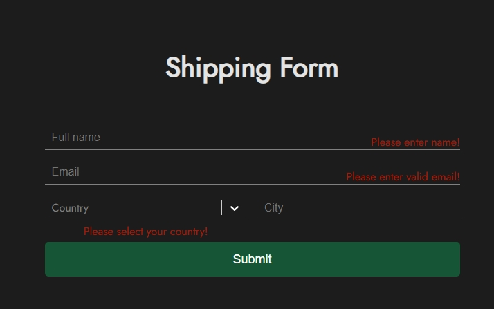

# Shipping Form

A simple form to fill out using several libraries:
- React
- React router v6
- React Hook Form
- React Select

#### Why do we need a library "React router" in this project?

It moves us to the main page (__Home__), if the following rules are met:

>__1. Valid form filling (no errors):__

>__2. Button press "Submit":__

### Final result:

